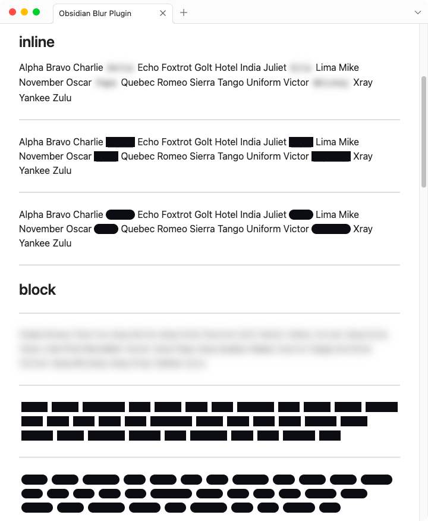
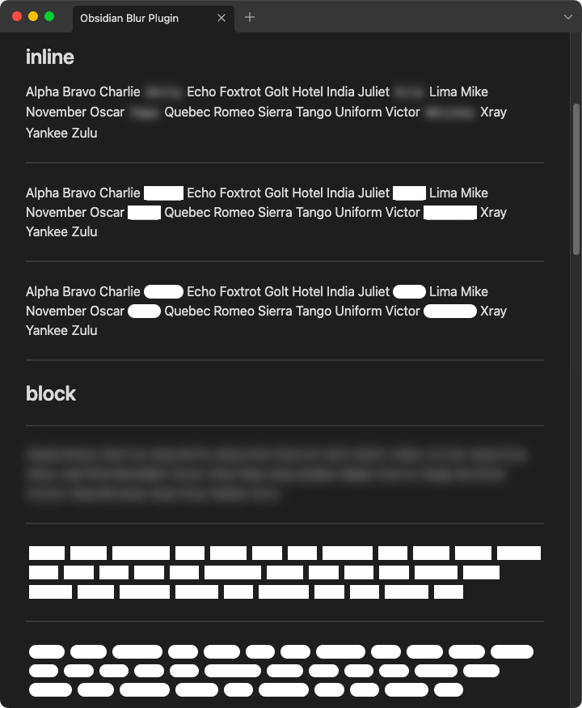
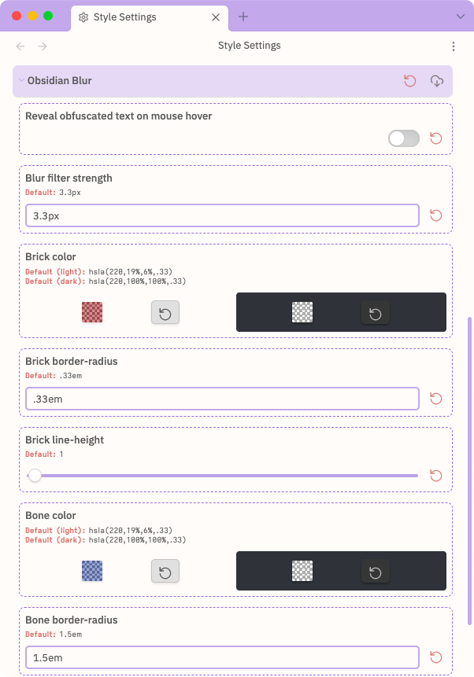

# blur

Light-weight [Obsidian.md](https://obsidian.md/) plugin for creating obfuscated blocks of text.

2 modes:

1. `inline`
2.  `block` i.e. code fence

3 methods:

1.  **blur** — useful for ==obfuscating==
2.  **brick** — useful for ==redacting==
3.  **bone** — useful for ==wire-framing==

---

## inline

##### blur

```markdown
Alpha Bravo Charlie `~{Delta}` Echo Foxtrot Golt Hotel India Juliet `~{Kilo}` Lima Mike November Oscar `~{Papa}` Quebec Romeo Sierra Tango Uniform Victor `~{Whiskey}` Xray Yankee Zulu
```

##### brick

```markdown
Alpha Bravo Charlie `~[Delta]` Echo Foxtrot Golt Hotel India Juliet `~[Kilo]` Lima Mike November Oscar `~[Papa]` Quebec Romeo Sierra Tango Uniform Victor `~[Whiskey]` Xray Yankee Zulu
```

##### bone

```markdown
Alpha Bravo Charlie `~(Delta)` Echo Foxtrot Golt Hotel India Juliet `~(Kilo)` Lima Mike November Oscar `~(Papa)` Quebec Romeo Sierra Tango Uniform Victor `~(Whiskey)` Xray Yankee Zulu
```

---

## block

##### blur

````
```blur
Alpha Bravo Charlie Delta Echo Foxtrot Golt Hotel India Juliet Kilo Lima Mike November Oscar Papa Quebec Romeo Sierra Tango Uniform Victor Whiskey Xray Yankee Zulu
```
````

##### brick

````
```blur-brick
Alpha Bravo Charliez Delta Echo Foxtrot Golt Hotel India Juliet Kilo Lima Mike November Oscar Papa Quebec Romeo Sierra Tango Uniform Victor Whiskey Xray Yankee Zulu
```
````

##### bone

````
```blur-bone
Alpha Bravo Charlie Delta Echo Foxtrot Golt Hotel India Juliet Kilo Lima Mike November Oscar Papa Quebec Romeo Sierra Tango Uniform Victor Whiskey Xray Yankee Zulu
```
````

---

## results





---

## plugin installation

From Obsidian's settings or preferences:

1. ~~Community Plugins > Browse~~
2. ~~Search for "iconoir"~~

or:

1. download the latest [release archive](https://github.com/gapmiss/blur/releases/download/1.0.0/blur-v1.0.0.zip)
2. uncompress the downloaded archive
3. move the `blur` folder to `/path/to/vault/.obsidian/plugins/` 
4.  Settings > Community plugins > reload **Installed plugins**
5.  enable plugin

or:

1.  download `main.js`, `manifest.json` & `styles.css`
2.  create a new folder `/path/to/vault/.obsidian/plugins/blur`
3.  move all 3 files to `/path/to/vault/.obsidian/plugins/blur`
4.  Settings > Community plugins > reload **Installed plugins**
5.  enable plugin

---

## customization

Custom `CSS` styles can be applied via the [obsidian-style-settings](https://github.com/mgmeyers/obsidian-style-settings) plugin.

### video demo

<video style="max-width:100%;">
  <source src="assets/demo-for-style-settings.mp4" type="video/mp4">
</video>

<video src="assets/demo-for-style-settings.mp4" data-canonical-src="assets/demo-for-style-settings.mp4" controls="controls" muted="muted" style="max-width:100%">
</video>


### effects

1. **blur** — `filter`
2. **brick** —`line-height`, `background-color`, `border-radius`
3. **bone** — `line-height`, `background-color`, `border-radius`
and
4. **editor** — `toggle` to reveal obfuscated text on mouse hover



##### `CSS` snippet for setting styles

The [obsidian-style-settings](https://github.com/mgmeyers/obsidian-style-settings) plugin is required for the following.

1. create an `obsidian-blur-plugin.css` snippet file with the content below

or

1. download [obsidian-blur-plugin.css](assets/obsidian-blur-plugin.css)

then

2. save file to `/path/to/vault/.obsidian/snippets`
3. enable snippet under *Settings > Appearance > CSS snippets*

```yaml
/* @settings

name: Blur Plugin
id: obsidian-blur
settings:
-
  id: obsidian-blur-hover
  title: Reveal obfuscated text on mouse hover
  type: class-toggle
  default: false
-
  id: obsidian-blur-filter
  title: Blur filter strength
  type: variable-text
  default: 5px
-
  id: obsidian-blur-brick-color
  title: Brick color
  type: variable-themed-color
  format: hsl
  opacity: true
  default-light: 'hsla(220,19%,6%,1)'
  default-dark: 'hsla(220,100%,100%,1)'
-
  id: obsidian-blur-brick-border-radius
  title: Brick border-radius
  type: variable-text
  default: 1px
-
  id: obsidian-blur-brick-line-height
  title: Brick line-height
  type: variable-number-slider
  default: 1
  min: 1
  max: 2
  step: .05
- 
  id: obsidian-blur-bone-color
  title: Bone color
  type: variable-themed-color
  format: hsl
  opacity: true
  default-light: 'hsla(220,19%,6%,1)'
  default-dark: 'hsla(220,100%,100%,1)'
-
  id: obsidian-blur-bone-border-radius
  title: Bone border-radius
  type: variable-text
  default: 1.5em
-
  id: obsidian-blur-bone-line-height
  title: Bone line-height
  type: variable-number-slider
  default: 1
  min: 1
  max: 2
  step: .05
-
*/
```

