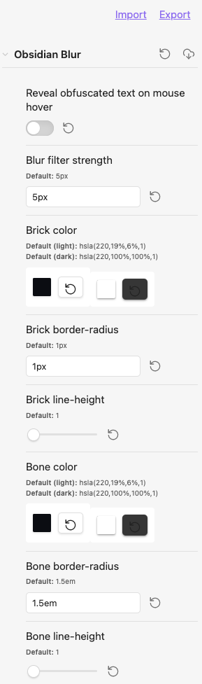

# obsidian-blur


Obsidian plugin for creating obfuscated blocks of text.

3 methods are available.

1. **blur** - useful for obfuscating
2. **brick** - useful for redacting
3. **bone** - useful for wire-framing

2 modes:

1. `block` i.e. code fence
2. `inline`

## methods


### blur

#### block

````
```blur
lorem ipsum dolor sit amet, consectetur adipiscing elit.
```
````

#### inline

```markdown
lorem `~{}ipsum dolor` sit amet, `~{}consectetur` adipiscing elit.
```

##### examples


---

### brick

#### block

````
```blur-brick
lorem ipsum dolor sit amet, consectetur adipiscing elit.
```
````

#### inline

```markdown
lorem `~[]ipsum dolor` sit amet, `~[]consectetur` adipiscing elit.
```

#### examples


---

### bone

#### block

````
```blur-bone
lorem ipsum dolor sit amet, consectetur adipiscing elit.
```
````

#### inline

```markdown
lorem `~()ipsum dolor` sit amet, `~()consectetur` adipiscing elit.
```

##### examples


---

### inline (multiple methods)


```markdown
lorem ipsum `~{}dolor` sit amet, consectetur `~[]adipiscing` elit. morbi bibendum commodo congue. vivamus `~()efficitur` aliquam felis, id viverra eros blandit sit amet. nam `~{}feugiat` purus ac sem aliquam, sit amet dictum dui bibendum. sed `~{}tincidunt` porttitor odio at feugiat. cras sed viverra libero. `~()suspendisse` potenti. nulla eu ullamcorper quam, in `~[]tempus nulla`. quisque `~{}accumsan` euismod finibus.
```

##### example


---

## installation

1. download `main.js`, `manifest.json` & `styles.css`
2. create a new folder `/path/to/vault/.obsidian/plugins/obsidian-blur`
3. move all 3 files to `/path/to/vault/.obsidian/plugins/obsidian-blur`
4. Settings > Community plugins > reload **Installed plugins**
5. enable plugin

## customization

Custom `CSS` styles can be applied via the [obsidian-style-settings](https://github.com/mgmeyers/obsidian-style-settings) plugin.

1. **blur** — `filter`
2. **brick** —`line-height`, `background-color`, `border-radius`
3. **bone** — `line-height`, `background-color`, `border-radius`
and
4. **editor** — `toggle` to reveal obfuscated text on mouse hover



### `CSS` snippet for setting styles

The [obsidian-style-settings](https://github.com/mgmeyers/obsidian-style-settings) plugin is required for the following.

1. create an `obsidian-blur-plugin.css` snippet file with the content below
2. save file to `/path/to/vault/.obsidian/snippets`
3. enable snippet under *Settings > Appearance > CSS snippets*

```yaml
/* @settings

name: Obsidian Blur
id: obsidian-blur
settings:
-
  id: obsidian-blur-hover
  title: Reveal obfuscated text on mouse hover
  type: class-toggle
  default: false
-
  id: obsidian-blur-filter
  title: Blur filter strength
  type: variable-text
  default: 3.3px
-
  id: obsidian-blur-brick-color
  title: Brick color
  type: variable-themed-color
  format: hsl
  opacity: true
  default-light: 'hsla(220,19%,6%,.33)'
  default-dark: 'hsla(220,100%,100%,.33)'
-
  id: obsidian-blur-brick-border-radius
  title: Brick border-radius
  type: variable-text
  default: .33em
-
  id: obsidian-blur-brick-line-height
  title: Brick line-height
  type: variable-number-slider
  default: 1
  min: 1
  max: 2
  step: .05
- 
  id: obsidian-blur-bone-color
  title: Bone color
  type: variable-themed-color
  format: hsl
  opacity: true
  default-light: 'hsla(220,19%,6%,.33)'
  default-dark: 'hsla(220,100%,100%,.33)'
-
  id: obsidian-blur-bone-border-radius
  title: Bone border-radius
  type: variable-text
  default: 1.5em
-
  id: obsidian-blur-bone-line-height
  title: Bone line-height
  type: variable-number-slider
  default: 1
  min: 1
  max: 2
  step: .05
-
*/
```
